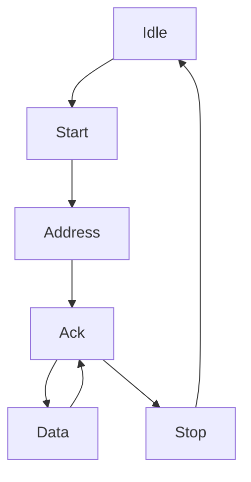

# Overview

This file contains the low-level hardware implementation details fow how the I2C protocol functions along with how the I2C controller utilizes the information to interpret the data correctly.

# Controller

In the setup we expect to see only one controller(master) which will send data and requests to each of the peripheral units. To implement this module this setup utilizes a state machine which will format packages appropriately.

## State Machine

# Peripheral

## State Machine

# Useful Documents

https://www.circuitbasics.com/basics-of-the-i2c-communication-protocol/
https://www.ti.com/lit/an/slva704/slva704.pdf?ts=1742360174522

## Other Implementations
https://github.com/alexforencich/verilog-i2c/blob/master/rtl/i2c_master.v
https://github.com/fpganinja/taxi
