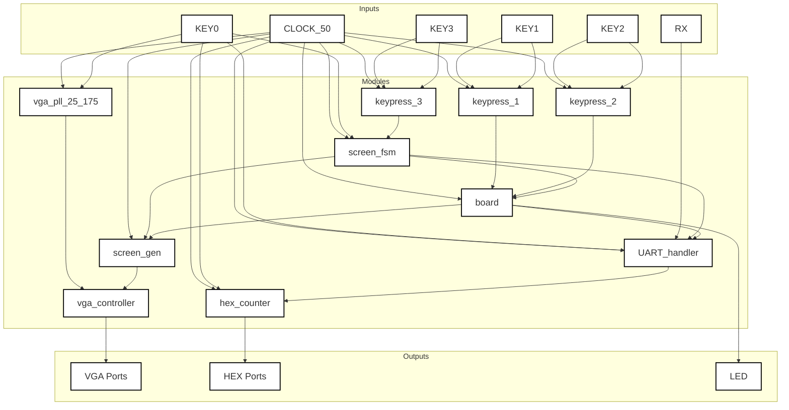

# UART

While other protocols such as i2c would work UART is a fairly simple and straightforward protocol that allow for very easy implementation. A system such as UART also allows for significantly less overhead for each packet such as address, read/write bit, acks. While a UART setup is less sophisticated and vulnerable to bit loss.

## Packets

Our setup will utilized a semi-modified version of UART that allows for sending all desired information in a singular packet avoiding data spanning multiple packets.

- 1 Start Bit
- 32 Data Bits
- 1 Parity Bits
- 1 Stop Bit

To create a setup that is effective in the long-term you would need to utilize an oversampling based setup which ensures the system receives the correct values.

## System Design

## Useful links

https://www.analog.com/en/resources/analog-dialogue/articles/uart-a-hardware-communication-protocol.html

https://www.circuitbasics.com/basics-uart-communication/
